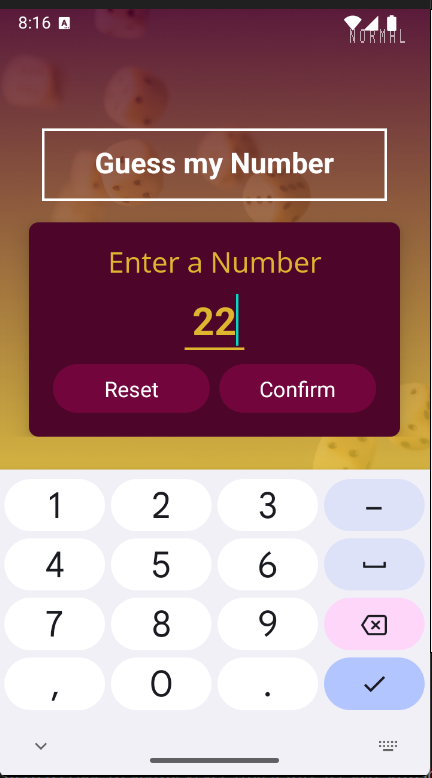
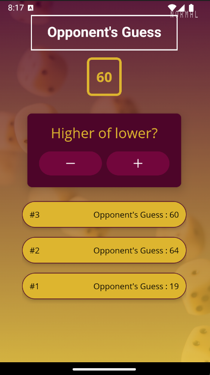
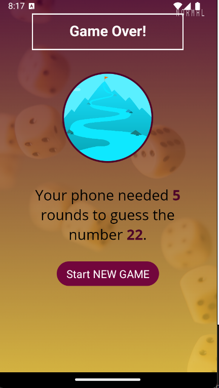

# Number Guessing Game

## 프로젝트 개요

이 프로젝트는 프로그램이 사용자의 번호를 추측해 맞추는 up down 게임입니다. 프로그램은 사용자의 번호를 맞추려고 시도하며 각 시도에 대해 사용자는 UP 혹은 DOWN 으로 힌트를 주게 됩니다. 프로그램이 사용자의 숫자를 정확하게 맞추는데까지 걸리는 추측의 횟수가 기록됩니다.

[Maximilian Schwarzmüller](https://www.linkedin.com/in/maximilian-schwarzmueller/) 선생님의 Udemy 강의를 기반으로 합니다.

## 기능

- 숫자 범위 설정
- 사용자 입력 받기
- 정답 확인 및 피드백 제공
- 게임 재시작 기능
- ios/android 대응
- portrait/landscape 모드 대응

## 관련 학습 내용 정리(개인블로그)

https://velog.io/@laejunkim/RN-3

https://velog.io/@laejunkim/RN-4

https://velog.io/@laejunkim/RN-5

https://velog.io/@laejunkim/RN-6

## 사용 예제

게임을 시작하면, 사용자는 임의의 숫자를 하나 정하고 프로그램은 이를 추측합니다. 사용자는 프로그램이 추측한 번호를 보고 자신의 번호보다 큰지 작은지 여부를 알려주어 프로그램이 사용자의 번호를 맞추도록 유도합니다. 프로그램이 몇번 안에 번호를 정확하게 맞추는지를 가지고 술자리에서 내기 등을 할 수 있습니다.

## 샘플 이미지

